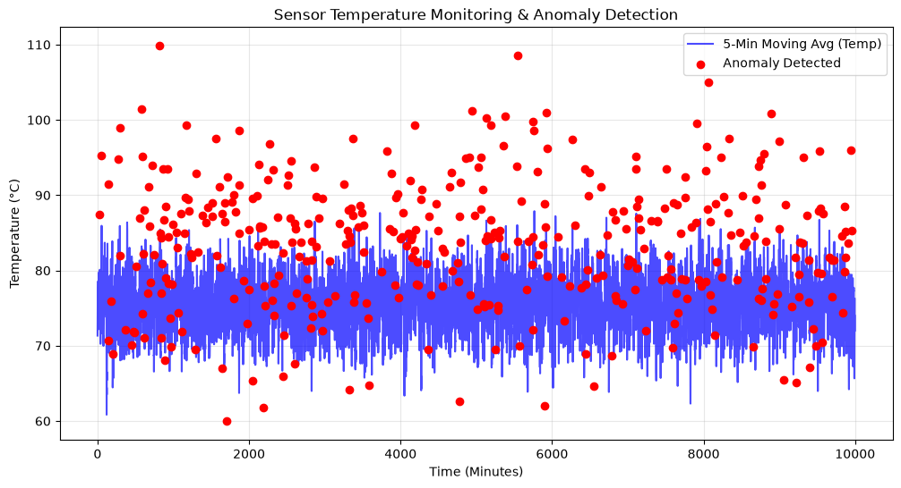

# Industrial IoT Sensor Analytics Pipeline

An automated data pipeline designed to ingest, clean, and analyze time-series sensor data from chemical engineering equipment (fluid mechanics tables and distillation columns). The system uses engineered features to predict imminent equipment anomalies before physical failure occurs.

## Tech Stack
* **ETL Pipeline:** Python, Pandas, NumPy
* **Database:** SQLite
* **Machine Learning:** Scikit-Learn (Logistic Regression)

## Architecture

### 1. Data Ingestion & Engineering (ETL)
The pipeline ingests raw time-series IoT logs tracking physical parameters like pressure, temperature, and mass transfer. During the cleaning phase, domain-specific constraints are enforced:
* Standardizes fluid mechanics pipe length ($L$) to exactly 186 cm across all test cases.
* Processes distillation supply feeds by strictly treating the parameter $M$ as the mass of impurities, using molecular weight to dynamically calculate moles.

The script then generates 5-minute rolling averages for temperature and pressure, calculates the rate of change for mass transfer spikes, and loads the cleaned data into a local SQLite database (`sensor_features`).

### 2. Predictive Maintenance Model
A binary classification model pulls the engineered features from SQLite. It evaluates the rolling gradients and physical parameter deviations to predict the `anomaly_detected` flag, effectively acting as an early warning system for lab equipment.

## Local Setup

### 1. Clone the repository
```bash
git clone [https://github.com/shaivatva/iot-sensor-analytics.git](https://github.com/shaivatva/iot-sensor-analytics.git)
cd iot-sensor-analytics

## Results



**Model Performance:**
*   **Precision:** [Paste your number from the notebook]
*   **Recall:** [Paste your number from the notebook]
*   **F1-Score:** [Paste your number from the notebook]